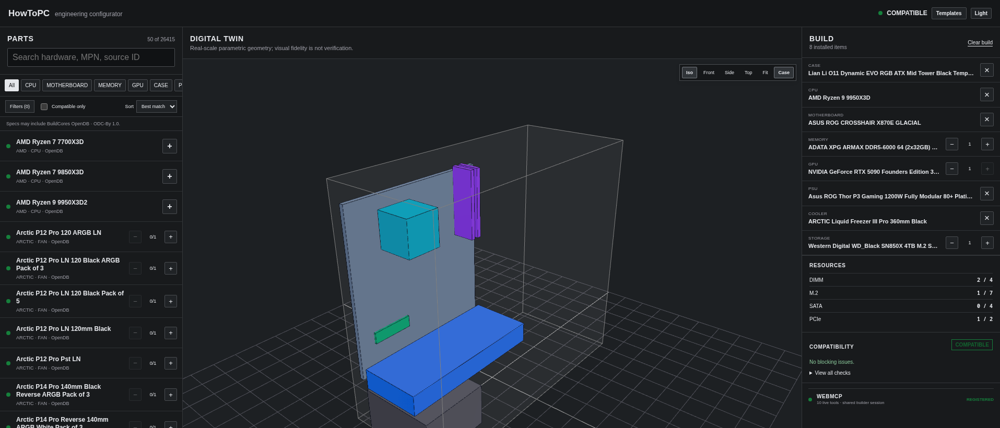
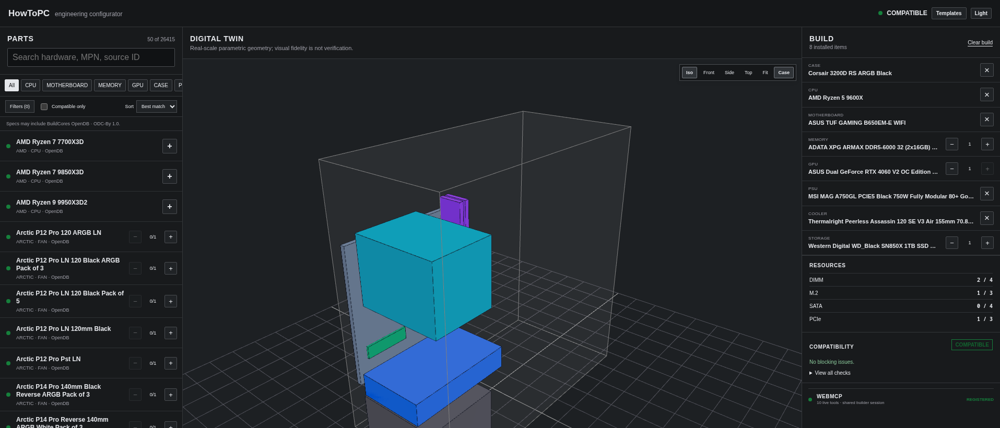
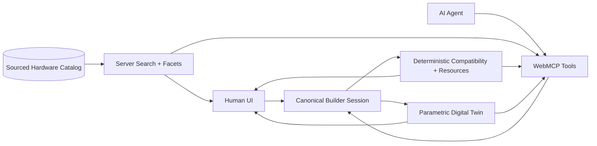

<div align="center">

# HowToPC

### An agent-native PC configurator where humans and AI build the same machine together.

**The human chooses what they care about. The agent handles the compatibility maze. Both build the same PC.**

[](https://webmachinelearning.github.io/webmcp/)
[](https://webmcp.devpost.com/)
[](#real-hardware-not-a-demo-catalog)
[](#engineering-confidence)
[](https://nextjs.org/)
[](https://www.typescriptlang.org/)
[](LICENSE)
[](https://howtopc.vercel.app)

[**Launch HowToPC →**](https://howtopc.vercel.app) · [**30-second WebMCP test →**](#try-it-in-30-seconds) · [**See the 10 tools →**](#10-structured-webmcp-tools)

</div>

---

## See the configurator

<p align="center">
  <a href="https://howtopc.vercel.app">
    
  </a>
</p>

<p align="center"><sub><strong>High-End Gaming PC:</strong> Ryzen 9 9950X3D + RTX 5090 Founders Edition. The same screen exposes the sourced catalog, live build, resource usage, compatibility, parametric Digital Twin, and <strong>10 registered WebMCP tools</strong>.</sub></p>

<details>
<summary><strong>See the RTX 4060 starter build</strong></summary>
<br>
<p align="center">
  <a href="https://howtopc.vercel.app">
    
  </a>
</p>
</details>

---

## PC building is a constraint problem disguised as shopping

A first-time builder should not need to become a motherboard specification expert before they are allowed to buy a computer.
Choosing parts means reasoning about CPU sockets, memory generations, PCIe capacity, storage interfaces, power budgets, native PSU connectors, case clearances, cooler support, drive bays, and physical placement. Traditional configurators make the person work through that maze manually. General-purpose agents face the opposite problem: on an ordinary website they must infer hidden state from pixels, visible rows, and UI controls.

**HowToPC gives both sides a better interface.**

The browser UI and the AI agent operate the **same canonical builder session**, backed by the same sourced hardware catalog, deterministic compatibility engine, resource accounting, and parametric Digital Twin. WebMCP turns HowToPC from a website an agent can click into a configurator an agent can understand.

## At a glance

| | |
|---|---|
| **26,415 sourced products** | 26,408 normalized from a pinned BuildCores OpenDB snapshot + 7 curated sourced references |
| **10 WebMCP tools** | Search, inspect, mutate, diagnose, and find compatible hardware |
| **One shared build state** | Human edits and agent edits immediately see each other |
| **Deterministic compatibility** | The language model does not decide whether hardware fits |
| **Server-side full-set search** | Query, facets, and compatibility run before pagination |
| **Parametric Digital Twin** | Known geometry is placed and checked; missing topology stays unknown |
| **182 automated tests** | Catalog, compatibility, geometry, WebMCP, API, onboarding, and session behavior |

> **Design rule: Unknown is not compatible.** Missing evidence never becomes a green checkmark.

---

## Why WebMCP?

WebMCP is the difference between an agent *operating a webpage* and an agent *participating in the product*.

| Ordinary browser automation | HowToPC with WebMCP |
|---|---|
| Reads whatever happens to be visible | Searches the structured hardware catalog |
| Clicks controls and guesses UI intent | Calls purpose-built tools with typed inputs |
| Can lose a product after pagination changes | Resolves canonical products by stable ID |
| Infers build state from the page | Reads the exact shared builder session |
| May reason from incomplete specification text | Receives deterministic compatibility results |
| Needs a separate automation path | Uses the same mutation engine as human actions |
| Has no mechanical model | Can query resource and geometry diagnostics |

The result is a genuinely **human-agent collaborative workflow**: a person can make subjective choices like case style, favorite CPU, or a specific GPU, while the agent performs the repetitive catalog search and constraint checking. Either side can take over at any moment without translating the build into a chat transcript.

### The important implementation detail

WebMCP is **not** connected to a privileged demo database or a second agent-only build model. Agent mutations pass through the same compatibility-aware builder session used by the UI. If an edit is unsafe or cannot be proven safe, the mutation is blocked for both.

---

## Try it in 30 seconds

Open **[howtopc.vercel.app](https://howtopc.vercel.app)** in a WebMCP-capable client. For Chrome testing, use Chrome 149+ with `chrome://flags/#enable-webmcp-testing` enabled and restart the browser. Then:

1. Click **Templates → RTX 4060 Gaming PC** to load a known-good eight-part build.
2. Ask the agent: **"Read my current build and show the compatibility and geometry reports."**
3. Ask: **"Find a stronger compatible GPU, inspect a top match, and replace my current GPU if it remains safe."**
4. Watch the visible **Build**, **Resources**, **Compatibility**, and **Digital Twin** update from the same committed session.
5. Change a component manually, then ask: **"Read my build again and tell me what changed."**

> The interesting part is the handoff: the person and agent alternate control without scraping the page or maintaining separate copies of the configuration. The agent reads and mutates the exact builder session the person sees.

---

## 10 structured WebMCP tools

| Tool | What it exposes to the agent |
|---|---|
| `builder_get_state` | Read the canonical current build |
| `catalog_search` | Search the real catalog with category filters, facets, sorting, pagination, and compatibility |
| `catalog_inspect_product` | Resolve and inspect one canonical sourced product |
| `builder_add_product` | Add or increment a product through compatibility-checked mutation logic |
| `builder_remove_product` | Remove or decrement an installed product |
| `builder_replace_product` | Replace a singleton component safely |
| `builder_compatibility_report` | Read deterministic compatibility results and reasons |
| `builder_resource_usage` | Inspect DIMM, PCIe, M.2, SATA, and other modeled resource usage |
| `builder_geometry_diagnostics` | Inspect placement issues and mechanical collisions from the Twin |
| `builder_find_compatible` | Find compatible candidates against the live shared build |

These tools are registered with the browser's `document.modelContext` WebMCP surface and execute against the same application services used by the human interface.

```ts
// Simplified registration shape; the real schemas and handlers live in the app.
document.modelContext.registerTool({
  name: "catalog_search",
  description: "Search the public hardware catalog",
  inputSchema,
  execute: async (input) => searchCatalog(input),
});
```

## Architecture



### Why the architecture matters

- **One session, two operators.** Human and agent never need to synchronize separate copies of a build.
- **Full-set reasoning.** Search, facets, and compatibility are evaluated before pagination, so a compatible part cannot disappear merely because it was on page two.
- **Stable identity.** Installed products remain resolvable after the search page, category, or filters change.
- **Model-independent safety.** Compatibility decisions are deterministic application logic, not language-model opinion.
- **Honest geometry.** The Twin places what can be supported by sourced facts and reports uncertainty for what cannot.

---

## Unknown is not compatible

HowToPC deliberately distinguishes **known-safe**, **known-conflicting**, and **not provable from the available data**.

| Evidence state | Result | Mutation behavior |
|---|---|---|
| Required facts are known and constraints pass | `COMPATIBLE` | Can proceed |
| Known hardware facts conflict | `INCOMPATIBLE` | Blocked |
| A required compatibility fact is missing | `UNKNOWN` | Blocked |
| The build is missing a prerequisite component | `UNKNOWN / INCOMPLETE` | Explained, never painted green |

Examples of this philosophy in the current build:

- A second M.2 SSD is not advertised as safe until motherboard M.2 capacity is known.
- Drive bays come from sourced case capacity instead of being invented per installed drive.
- AIO pump/block geometry can be shown while an unsourced radiator mount remains `TOPOLOGY_UNKNOWN`.
- Missing fan-mount topology does not become an arbitrary high quantity limit.
- Modern GPU power connector naming is normalized while connector counts remain strict.

---

## Real hardware, not a demo catalog

The public catalog is generated deterministically from a pinned checkout of [BuildCores OpenDB](https://github.com/buildcores/buildcores-open-db), not from a hand-picked list built for the demo.

**Pinned source commit:** `7f759ec353714e9dca2adab9e62bd80311fc373e`

| Ingestion result | Count |
|---|---:|
| Source records scanned | **29,632** |
| Accepted canonical products | **26,408** |
| Rejected rather than guessed | **3,224** |
| Missing identity | 14 |
| Missing required compatibility field | 2,942 |
| Ambiguous source value | 268 |

### Accepted products by category

`CPU 788` · `Motherboard 3,515` · `Memory 4,807` · `GPU 3,774` · `Storage 3,311` · `PSU 3,239` · `Case 1,195` · `Cooler 2,386` · `Fan 3,345` · `Network 48`

The 48 Network adapters are intentionally conservative: they are accepted only when the sourced record itself provides enough explicit information to establish PCIe interface, link speed, and port count. The remaining NetworkCard records stay rejected rather than having those facts inferred.

There is currently **no public HBA inventory** because the pinned source contains no genuine HBA/controller category. The empty tab was removed instead of filling it with synthetic products.

Pricing and retailer offers are intentionally outside the canonical hardware model in this challenge build.

---

## What people and agents can do together

The project is designed around **handoffs**, not around replacing the UI with chat.

### Start with a human preference

A person picks the CPU or case they care about. The agent can search tens of thousands of real products, narrow the catalog to compatible candidates, inspect specifications, and continue the build without re-entering that choice.

### Interrupt the agent at any time

The person can manually replace a motherboard, add storage, or change the case. The next WebMCP call reads the same updated `BuilderSession`; there is no stale conversational copy of the configuration to reconcile.

### Ask for an explanation, not a guess

If a mutation is blocked, the agent can read the exact compatibility report and resource state: socket mismatch, missing connector capacity, exhausted M.2 slots, unknown mechanical topology, or another deterministic reason.

### Repair the build

The agent can search against the live configuration and propose or apply a compatible replacement. The visible Build pane and Digital Twin update from the same committed state.

That is the core WebMCP experiment: **the website remains excellent for a person, but its real capabilities are also directly legible and actionable to an agent.**

---

## Built during the WebMCP Challenge

Challenge-period work in this submission includes the pieces that make the app agent-native rather than simply adding a chat surface:

- normalized and generated the broad sourced hardware catalog used by both people and agents;
- introduced full-dataset server search, category facets, sorting, and compatibility-before-pagination;
- made compatibility resolver-aware so arbitrary catalog products, not only fixtures, can participate in a build;
- added a retained canonical builder session so installed products survive search/page changes;
- added first-visit **RTX 4060 Gaming PC** and **High-End Gaming PC** templates that replace the same canonical session used by the UI and WebMCP;
- added template regression gates requiring deterministic compatibility and zero modeled component collisions;
- exposed the public catalog and builder as **10 structured WebMCP tools**;
- routed human and agent edits through the same compatibility-aware mutation behavior;
- exposed compatibility, resource usage, and geometry diagnostics to the agent;
- hardened repeatable-part capacity so unknown limits cannot silently become arbitrary quantities;
- hardened the Digital Twin to avoid invented drive bays, fake AIO radiator placement, and known GPU/storage overlaps;
- expanded conservative real NetworkCard ingestion while continuing to reject underspecified records.

The WebMCP work is therefore part of the application's core state and domain model, not an isolated wrapper around the UI.

---

## Engineering confidence

The repository uses a workspace-wide verification gate covering TypeScript, unit/integration tests, and a production Next.js build.

```bash
pnpm verify
```

Current verified checkpoint: **53 test files / 182 tests passing**, with all workspace typechecks and the production build passing.

Representative regression coverage includes shared builder sessions, full-set search before pagination, unknown capacity, PSU/GPU connector families, AIO geometry, storage/GPU collision placement, public catalog routes, and WebMCP tool behavior.

---

## Project structure

| Path | Responsibility |
|---|---|
| `apps/web` | Next.js product UI, catalog API routes, retained builder session, and browser WebMCP integration |
| `packages/catalog` | Canonical hardware schemas, sourced catalog artifacts, identity search, and facets |
| `packages/compatibility` | Deterministic rules, transactions, resource accounting, and catalog resolvers |
| `packages/geometry` | Parametric topology, mount allocation, collision detection, and Twin scene generation |
| `packages/ingestion` | BuildCores normalization, rejection policy, provenance, and deterministic artifact generation |
| `packages/webmcp` | Structured WebMCP tool contracts |
| `packages/domain` | Core domain types and compatibility/provenance primitives |
| `packages/shared` | Shared utilities |
| `packages/db` | Database schema foundation |

The full generated hardware shards stay on the **server side**; the browser does not receive a 26k-product bundle.

## Run locally

Verified toolchain: **pnpm 11.24.0** with the repository's TypeScript/Next.js workspace.

```bash
git clone https://github.com/CodWasTaken/HowToPC.git
cd HowToPC
pnpm install
pnpm dev
```

Then open the local URL printed by Next.js. To run the same repository gate used before checkpoints:

```bash
pnpm verify
```

### Catalog regeneration

The committed generated catalog is reproducible from the pinned BuildCores checkout. The generator verifies the source Git commit before walking records and does not add timestamps or network-derived data to its artifacts.

```bash
BUILDCORES_DB_DIR=/path/to/buildcores-open-db \
  pnpm --filter @howtopc/ingestion generate:buildcores
```

---

## Data provenance & attribution

Hardware records are normalized from **BuildCores OpenDB** at the pinned source commit shown above. BuildCores OpenDB data is provided under **ODC-By 1.0**; generated HowToPC records preserve source attribution back to the originating OpenDB record.

HowToPC keeps provenance separate from compatibility conclusions: a source can tell us a dimension, connector, socket, or capacity, while deterministic application rules decide what those facts mean for the current build.

No unknown specification is silently filled with a plausible value just to increase catalog coverage.

---

## License

HowToPC source code is released under the [MIT License](LICENSE).

Third-party datasets keep their own licensing terms. In particular, BuildCores-derived hardware data remains subject to **ODC-By 1.0** and its required attribution; the MIT license does not relicense that source data.

---

<details>
<summary><strong>Current limitations: intentionally visible</strong></summary>

- **Pricing is intentionally excluded** from this challenge build. Hardware identity/specifications and merchant offers are separate concerns.
- **AIO radiator mount location is not guessed.** The CPU pump/block can be represented, while unsourced radiator topology is reported as `TOPOLOGY_UNKNOWN`.
- **Case fan mount topology is conservative.** Additional fans are not advertised as safely placeable without sourced capacity.
- **The Digital Twin is parametric, not manufacturer CAD.** It is a constraint/diagnostic view built from known dimensions and modeled mounting zones.
- **Network coverage is conservative.** 48 cards currently meet the required sourced-fact threshold.
- **HBA is absent** because the pinned source contains no genuine HBA/controller inventory.

These are deliberate honesty boundaries, not hidden green states.

</details>

---

## OpenAI WebMCP Challenge 2026

HowToPC is being developed for [The WebMCP Challenge](https://webmcp.devpost.com/), exploring what becomes possible when a complex web application exposes its real capabilities to agents as structured tools.

The project is built around the challenge's central idea: **web experiences should become meaningfully better when people and agents can use them together.**

- [WebMCP specification](https://webmachinelearning.github.io/webmcp/)
- [Chrome WebMCP documentation](https://developer.chrome.com/docs/ai/webmcp)
- [Challenge page](https://webmcp.devpost.com/)

<div align="center">

### The human chooses what they care about. The agent handles the compatibility maze. Both build the same PC.

</div>
